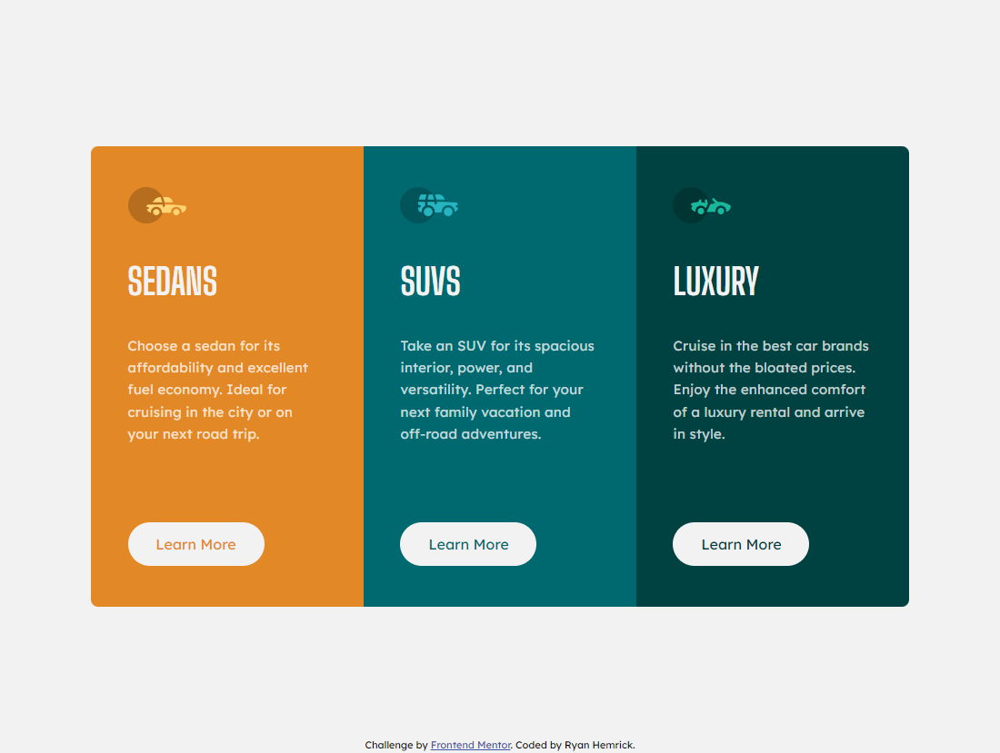

# Frontend Mentor - 3-column preview card component solution

This is a solution to the [3-column preview card component challenge on Frontend Mentor](https://www.frontendmentor.io/challenges/3column-preview-card-component-pH92eAR2-). Frontend Mentor challenges help you improve your coding skills by building realistic projects. 

## Table of contents

- [Overview](#overview)
  - [The challenge](#the-challenge)
  - [Screenshot](#screenshot)
  - [Links](#links)
- [My process](#my-process)
  - [Built with](#built-with)
  - [What I learned](#what-i-learned)
- [Author](#author)

## Overview
- A static 'three-column preview card' component built with HTML & CSS

### The challenge
- Build out this three-column preview card component and get it looking as close to the design as possible.

### Screenshot

### Links
- Live Site URL: https://famous-bavarois-a0a0ab.netlify.app

## My process
- My solution to this challenge was to use flexbox to vertically and horizontally center the component on the screen, as well as creating three responsive sections with equal widths
- Utilized a media query to adjust the layout and content spacing for mobile

### Built with
- Semantic HTML5 markup
- CSS custom properties
- Flexbox

### What I learned
- This challenge provided another opportunity to practice using Flexbox for layouts. I also used this challenge to practice writing more reusable and scalable CSS

## Author
- Ryan Hemrick